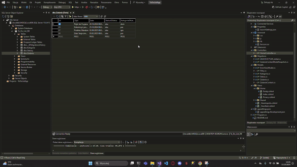

## Table of contents
* [General info](#general-info)
* [Technologie](#technologies)
* [Prezentacja](#Prezentacja)

## General info
ToDoListApp to aplikacja do zarządzania zadaniami, umożliwiająca dodawanie, usuwanie i oznaczanie zadań jako zrobione. 
Ułatwia organizację pracy, czasu oraz śledzenie postępów.

## Prezentacja

## Technologie
Project is created with:
* HTML (cshtml)
* CSS
* C#
* ASP.NET CORE
* Web.API
* Entity Framework Core
* Architektura MVC (model-view-controller)

